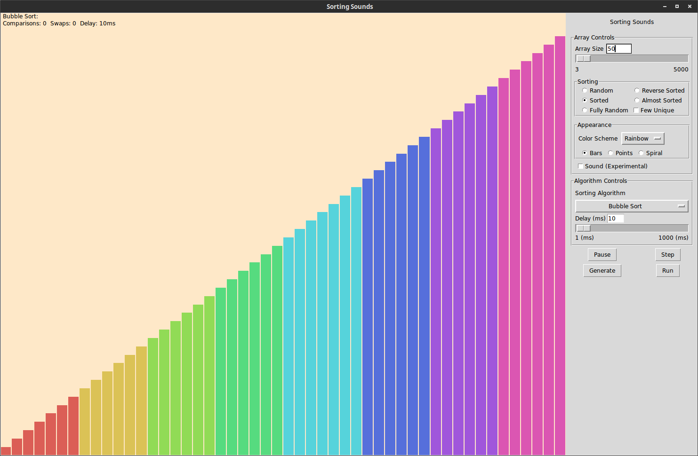

## Sorting Sounds
Sorting sounds is a sorting algorithm visualizer and audibilizer written in Python 2.7 with the user interface implemented using Tkinter. Inspired by Timo Bingmann's [The Sound of Sorting](http://panthema.net/2013/sound-of-sorting/), I created this project as an exercise in learning Python.



Sorting Sounds is capable of real time animation of sorting algorithms. The user is able to not only pause and play an animation, but also step through each algorithm and change the delay between animation steps. 

### Prerequisities
Python 2.7.6

PyAudio

```
pip install pyaudio
```
Numpy
```
pip install numpy
```

## Getting Started
To run simply use:
```
python gui.py
```

## License

This project is licensed under the GPL3 License - see the [LICENSE.md](LICENSE.md) file for details

## Acknowledgments
Many thanks to Timo Bingmann
